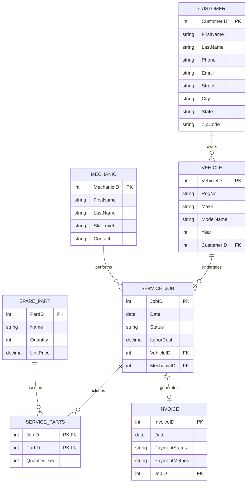
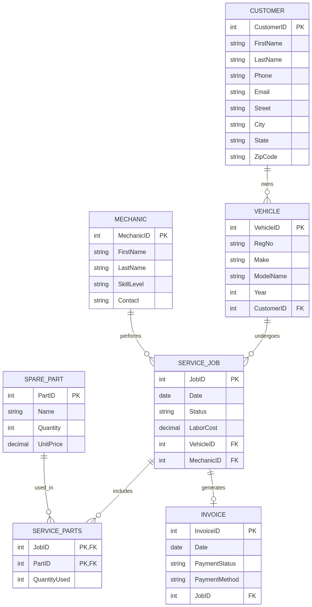

# Milestone 2: ERD Design & Normalization

## Step 1: Apply Normalization

### 1. Customer Table
*   **Original**: CustomerID (PK), Name, Phone, Email, Address
*   **1NF**: The `Name` and `Address` attributes are not atomic. `Name` can be split into First Name and Last Name. `Address` can be split into Street, City, State, and Zip Code.
    *   **Change Made**: Split `Name` into `FirstName` and `LastName`. Split `Address` into `Street`, `City`, `State`, and `ZipCode`.
*   **2NF**: Satisfied. The primary key (`CustomerID`) is a single attribute, so there are no partial dependencies. No changes needed.
*   **3NF**: Satisfied. No non-key attributes depend on other non-key attributes. No changes needed.

### 2. Vehicle Table
*   **Original**: VehicleID (PK), RegNo, Model, CustomerID (FK)
*   **1NF**: The `Model` attribute can often contain the Make, Model, and Year as a single string, which is not atomic.
    *   **Change Made**: Split `Model` into `Make`, `ModelName`, and `Year`.
*   **2NF**: Satisfied. The primary key (`VehicleID`) is a single attribute. No changes needed.
*   **3NF**: Satisfied. No transitive dependencies exist. No changes needed.

### 3. Mechanic Table
*   **Original**: MechanicID (PK), Name, SkillLevel, Contact
*   **1NF**: The `Name` attribute is not atomic.
    *   **Change Made**: Split `Name` into `FirstName` and `LastName`.
*   **2NF**: Satisfied. The primary key (`MechanicID`) is a single attribute. No changes needed.
*   **3NF**: Satisfied. No transitive dependencies exist. No changes needed.

### 4. ServiceJob Table
*   **Original**: JobID (PK), VehicleID (FK), MechanicID (FK), Date, Status, TotalCost
*   **1NF**: Satisfied. All attributes are atomic.
*   **2NF**: Satisfied. The primary key (`JobID`) is a single attribute.
*   **3NF**: The `TotalCost` attribute is a derived attribute (it can be calculated from the sum of `ServiceParts.QuantityUsed * SparePart.UnitPrice` plus any labor charges). Storing derived attributes violates 3NF as it creates a dependency on other tables and could lead to update anomalies.
    *   **Change Made**: Removed `TotalCost` from `ServiceJob`. Added `LaborCost` to `ServiceJob` so that the total cost can be calculated dynamically without violating 3NF.

### 5. SparePart Table
*   **Original**: PartID (PK), Name, Quantity, UnitPrice
*   **1NF**: Satisfied. All attributes are atomic.
*   **2NF**: Satisfied. The primary key (`PartID`) is a single attribute. No changes needed.
*   **3NF**: Satisfied. No transitive dependencies exist. No changes needed.

### 6. Invoice Table
*   **Original**: InvoiceID (PK), JobID (FK), Amount, Date
*   **1NF**: Satisfied. All attributes are atomic.
*   **2NF**: Satisfied. The primary key (`InvoiceID`) is a single attribute. No changes needed.
*   **3NF**: Similar to `ServiceJob`, the `Amount` attribute is derived from parts and labor.
    *   **Change Made**: Removed `Amount` as it's a derived attribute. Added `PaymentStatus` and `PaymentMethod` to make the `Invoice` table hold non-derived billing information.

### 7. ServiceParts (Junction Table)
*   **Original**: JobID (FK), PartID (FK), QuantityUsed
*   **1NF**: Satisfied. All attributes are atomic.
*   **2NF**: Satisfied. The composite primary key is (`JobID`, `PartID`). `QuantityUsed` depends on the entire primary key, not just a part of it. No changes needed.
*   **3NF**: Satisfied. No transitive dependencies exist. No changes needed.

---

## Step 2: Remove Duplicates

*   **Overlapping Attributes**: The `TotalCost` in `ServiceJob` and `Amount` in `Invoice` were redundant and overlapping. Both were derived data representing the same concept (the final bill). 
*   **Action Taken**: Both `TotalCost` and `Amount` were removed during the 3NF normalization process. Instead of storing redundant derived data, the system will calculate the total cost dynamically by summing `ServiceJob.LaborCost` and the associated `ServiceParts` (`QuantityUsed * UnitPrice`). This removes redundancy and prevents data inconsistency.

---

## Step 3: Updated ERD

Below is the updated ER Diagram reflecting all normalization changes:

